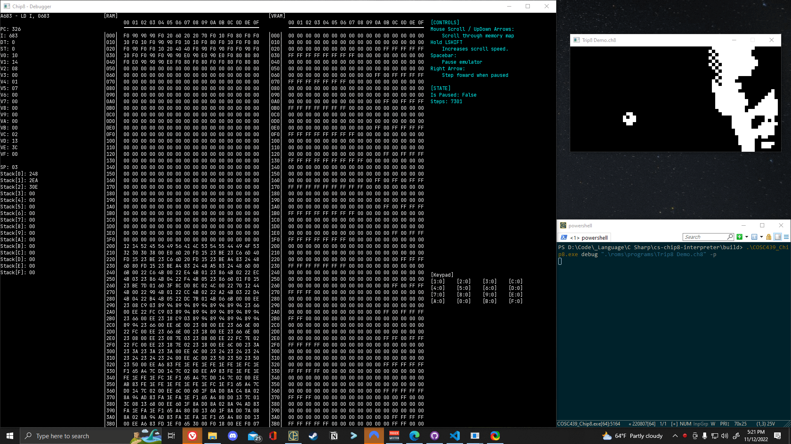

# Chip8 Interpreter
<p align="center">
    
</p>

## About

This is a simple Chip8 interpreter, written in C#, which was created for my operating systems class. We had the opportunity to select and pitch our own projects and I selected this out of a personal interest in emulation.

## Usage

### Launching
Run chip8 executable in command line providing the required arguments...
 
*NOTE: romPath must be surrounded by quotes!*

```
> COSC439_Chip8.exe run <romPath> // Launch
> COSC439_Chip8.exe debug <romPath> // Launch in debug mode
> COSC439_Chip8.exe debug <romPath> -p // Launched in debug mode starting paused 
```

### Keypad
The keypad uses the following key binds. These keys correspond to Chip8's keys from 0 - 0xF
```
1 2 3 4
q w e r
a s d f
z x c v
```
### Controls
**F5** - Reload program

### Debug Controls
*NOTE: Must be performed inside debugger window*

**Mouse Scroll or Up/Down Arrow Keys** - Scroll through memory map

**Hold LSHIFT** - Increases scroll speed while held

**Spacebar** - Pause emulator

**Right Arrow** - Step forward when paused

# Credits

- [Chip8 Technical specifications](http://devernay.free.fr/hacks/chip8/C8TECH10.HTM)

- [Chip8 ROMs](https://github.com/kripod/chip8-roms)